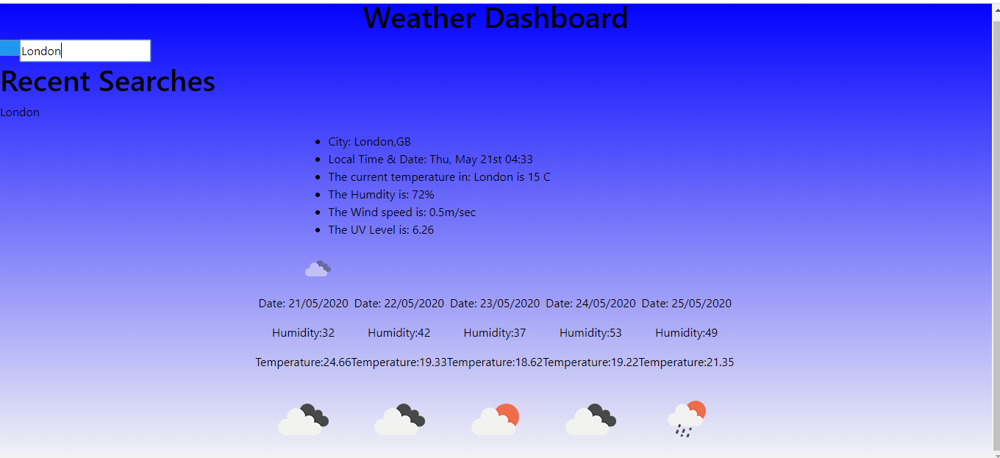

# Weather App Homework

# Description

This is a webb app that utilises the OpenWeatherMap API to return a current forecast for the searched city, as well as a five day one too. 

# Screenshot

# Technology

This is a static site. It uses HTML, CSS, JavaScript and jQuery. 

[Click here to see the api used](https://openweathermap.org/api)